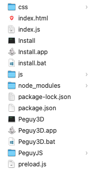

# Péguy 3D
Péguy 3D is a 3D procedural generation software based on [Electron](https://www.electronjs.org/) and [Péguy.js](https://github.com/Killfaeh/Peguy.js).</br>

Here is some examples of what you can do with Péguy 3D.</br>

<div align="center">
</br>

</div></br>

Péguy 3D can assist you to create ambitious scene in your favorite 3D program like Blender.</br>

<div align="center">

</div>

## Installation

### Install Node.js

You need to install Node.js to run Péguy Editor.

**Windows**

Download the installation file on Node.js web site : [https://nodejs.org/fr/download/prebuilt-installer](https://nodejs.org/fr/download/prebuilt-installer) </br>
Run it as administrator.

**Mac OS**

Open a terminal. </br>
Install Homebrew if you haven't already.

```bash
/bin/bash -c "$(curl -fsSL https://raw.githubusercontent.com/Homebrew/install/HEAD/install.sh)"
```

Then, install Node.js and npm.

```bash
brew install node
brew install npm
```

**Linux**

Open a terminal and run these 2 commands.

```bash
sudo apt install nodejs
sudo apt install npm
```

### Download and extract the archive

Download the project archive via this Google Drive link : [https://drive.google.com/file/d/1_qa4gY91YD3ym3CBluAAO4KrqTUUnwvU/view?usp=sharing](https://drive.google.com/file/d/1_qa4gY91YD3ym3CBluAAO4KrqTUUnwvU/view?usp=sharing) </br>
Then, extract it.

<div align="center">
</br>
Archive content
</div>

### Run the application

**Windows**

If you run Péguy Editor for the first time, run install.bat (double clic).</br>
Then, run PeguyEditor.bat (double clic).

**Mac OS**

Run PeguyEditor.app (double clic).</br>
You can put PeguyEditor.app in your dock.

**Linux**

Run PeguyEditor in a terminal.

## How to use

Blablabla
