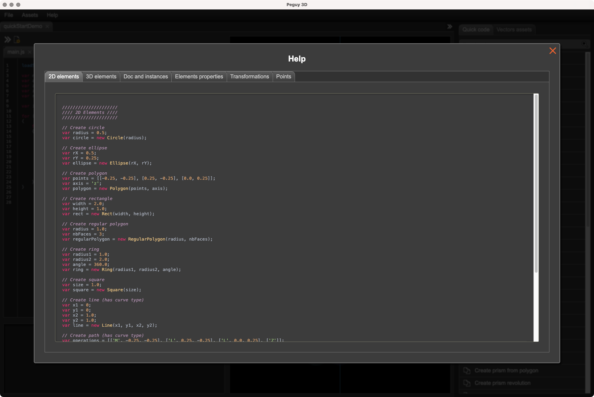

# Péguy 3D
Péguy 3D is a 3D procedural generation software based on [Electron](https://www.electronjs.org/) and [Péguy.js](https://github.com/Killfaeh/Peguy.js).</br>

Here is some examples of what you can do with Péguy 3D.</br>

<div align="center">
</br>

</div></br>

Péguy 3D can assist you to create ambitious scene in your favorite 3D program like Blender.</br>

<div align="center">

</div>

## Table of Contents

1. [Installation](#installation)
2. [How to use](#how-to-use)

## Installation

### Install Node.js

You need to install Node.js to run Péguy 3D.

**Windows**

Download the installation file on Node.js web site : [https://nodejs.org/fr/download/prebuilt-installer](https://nodejs.org/fr/download/prebuilt-installer) </br>
Run it as administrator.

**Mac OS**

Open a terminal. </br>
Install Homebrew if you haven't already.

```bash
/bin/bash -c "$(curl -fsSL https://raw.githubusercontent.com/Homebrew/install/HEAD/install.sh)"
```

Then, install Node.js and npm.

```bash
brew install node
brew install npm
```

**Linux**

Open a terminal and run these 2 commands.

```bash
sudo apt install nodejs
sudo apt install npm
```

### Download and extract the archive

Download the project archive via this Google Drive link : [https://drive.google.com/file/d/1_qa4gY91YD3ym3CBluAAO4KrqTUUnwvU/view?usp=sharing](https://drive.google.com/file/d/1_qa4gY91YD3ym3CBluAAO4KrqTUUnwvU/view?usp=sharing) </br>
Then, extract it.

<div align="center">
</br>
Archive content
</div>

### Run the application

**Windows**

If you run Péguy 3D for the first time, run install.bat (double clic).</br>
Then, run Peguy3D.bat (double clic).

**Mac OS**

Run Peguy3D.app (double clic).</br>
You can put Peguy3D.app in your dock.

**Linux**

Run Peguy3D in a terminal.

## How to use

### Basics

Here is how looks the interface.</br>

<div align="center">

</div></br>

A Péguy 3D project is a directory containing a file named project.json and a file named main.js. 
If you add new scripts to the project, they will be saved in this directory.</br>

To open an existing project, you have to open the project.json file of the project.</br>
To test your program, you just need to click on the left top double arrow.</br>
You can export the result in Wavefront (.obj) or Collada (.dae) format file.</br>
The quick code panel at right help you to write your code faster. Double click on the label or simple click on the copy/paste icon of the row which interests you and a code block will be pasted in your code.</br>

To add a script in your project, you have to click on the add file icon on the left top near the double arrow. </br>

<div align="center">

</div></br>

Then, enter a name and click on the Ok button.</br>

A common use of the multiscript approach is to create all materials used in the project and store them appart.</br>

<div align="center">

</div></br>

Then, to use others scripts in the project call them with the instruction loadScript('name-of-the-script'); for each additional script in the main script.</br>

<div align="center">

</div></br>

### Insert assets

<div align="center">

</div></br>

<div align="center">

</div></br>

<div align="center">

</div></br>

<div align="center">

</div></br>

### Built-in documentation

A documentation is available inside Péguy 3D. You can read it by clicking on the Help menu.</br>

<div align="center">

</div></br>
